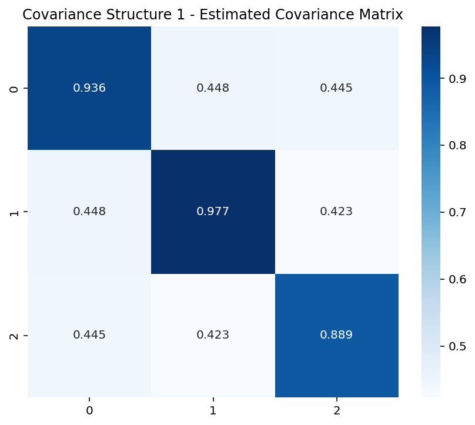
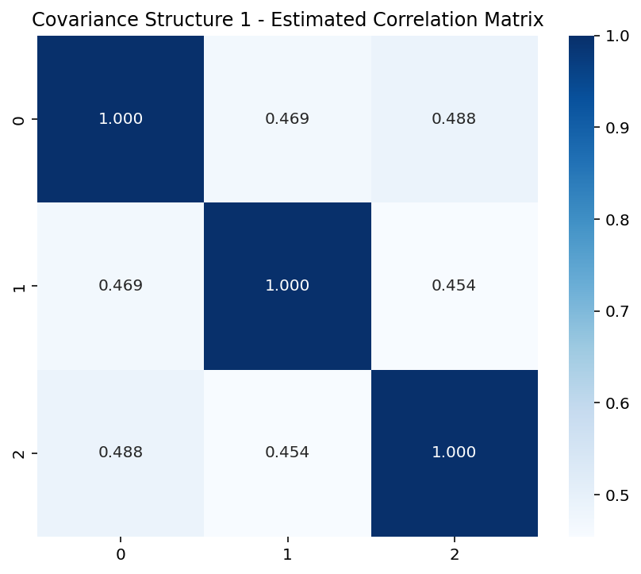
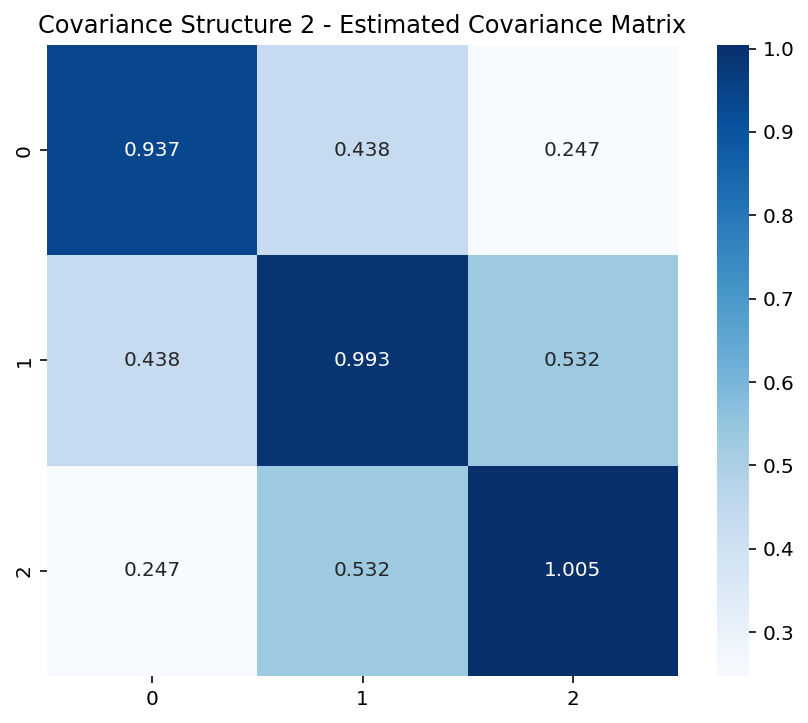
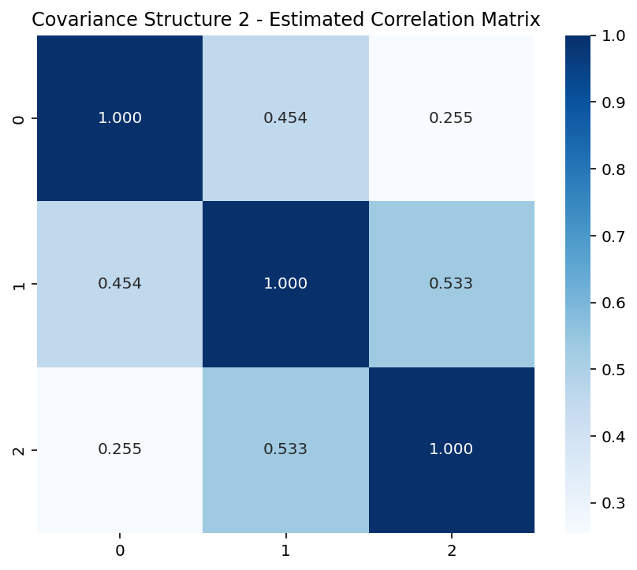

# Covariance Matrix Estimation

## Overview

This project simulates multivariate normal asset returns under two different covariance structures and estimates the corresponding sample covariance and correlation matrices.

The objective is to illustrate one of the fundamental building blocks of quantitative portfolio risk analysis by comparing theoretical covariance structures with their empirical estimates obtained from simulated financial returns.

Covariance and correlation matrices are widely used in:

- Portfolio Risk Measurement
- Mean-Variance Portfolio Optimization (Markowitz)
- Diversification Analysis
- Volatility Estimation
- Asset Allocation

---

## Methodology

The project follows the workflow below:

1. Define two theoretical covariance structures.
2. Simulate multivariate normally distributed asset returns.
3. Estimate the sample covariance matrix.
4. Estimate the sample correlation matrix.
5. Compare the estimated matrices with the theoretical covariance structures.
6. Visualize the estimated matrices using heatmaps.

---

## Technologies

- Python
- NumPy
- Matplotlib
- Seaborn

---

## Results

### Estimated Covariance Matrix (Structure 1)



### Estimated Correlation Matrix (Structure 1)



### Estimated Covariance Matrix (Structure 2)



### Estimated Correlation Matrix (Structure 2)



---

## Key Results

- The estimated covariance matrices closely reproduce the theoretical covariance structures used during the simulation.

- The estimated correlation matrices successfully recover the dependence relationships between the simulated assets.

- The second covariance structure exhibits a lower dependence between Asset 1 and Asset 3, which is correctly reflected in the estimated correlation matrix.

- The experiment demonstrates the consistency of the sample covariance estimator under multivariate normal assumptions and highlights its importance for portfolio risk analysis.

---

## How to Run

Install the required packages:

```bash
pip install -r requirements.txt
```

Run the script:

```bash
python covariance_matrix.py
```

---

## Repository Structure

```text
Covariance-Matrix-Estimation/
│
├── covariance_matrix.py
├── requirements.txt
├── README.md
├── LICENSE
├── covariance_structure_1.png
├── correlation_structure_1.png
├── covariance_structure_2.png
└── correlation_structure_2.png
```

---

## Applications in Quantitative Finance

Covariance matrix estimation is one of the core building blocks of quantitative finance and risk management. It is commonly applied to:

- Portfolio Risk Measurement
- Portfolio Optimization
- Asset Allocation
- Diversification Analysis
- Volatility Modelling
- Factor Models
- Risk Decomposition
- Market Risk Analytics
